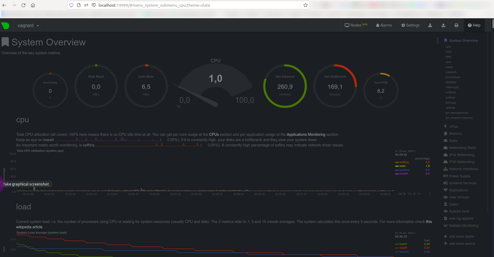

# Домашнее задание к занятию "3.4. Операционные системы, лекция 2"

1. На лекции мы познакомились с [node_exporter](https://github.com/prometheus/node_exporter/releases). В демонстрации его исполняемый файл запускался в background. Этого достаточно для демо, но не для настоящей production-системы, где процессы должны находиться под внешним управлением. Используя знания из лекции по systemd, создайте самостоятельно простой [unit-файл](https://www.freedesktop.org/software/systemd/man/systemd.service.html) для node_exporter:

    * поместите его в автозагрузку,
    * предусмотрите возможность добавления опций к запускаемому процессу через внешний файл (посмотрите, например, на `systemctl cat cron`),
    * удостоверьтесь, что с помощью systemctl процесс корректно стартует, завершается, а после перезагрузки автоматически поднимается.
    ```bash
    # wget https://github.com/prometheus/node_exporter/releases/download/v1.2.2/node_exporter-1.2.2.linux-amd64.tar.gz
    ```
    ```bash
    # tar xvfz node_exporter-1.2.2.linux-amd64.tar.gz
    ```
    ```bash
    # cp node_exporter-1.2.2.linux-amd64/node_exporter /usr/sbin/node_exporter
    ```
    ```bash
    # /usr/sbin/node_exporter
    ````

    ```bash
    # curl -s localhost:9100/metrics | tail -n 5
    # HELP promhttp_metric_handler_requests_total Total number of scrapes by HTTP status code.
    # TYPE promhttp_metric_handler_requests_total counter
    promhttp_metric_handler_requests_total{code="200"} 2
    promhttp_metric_handler_requests_total{code="500"} 0
    promhttp_metric_handler_requests_total{code="503"} 0
    ```

    Источник:

    https://github.com/prometheus/node_exporter/tree/master/examples/systemd

    ```bash
    # groupadd --system --gid 1001 node_exporter
    ```
    ```bash
    # useradd -s /sbin/nologin --system --uid 1001 --gid node_exporter node_exporter
    ```
    ```bash
    # echo '"OPTIONS="--collector.textfile.directory /var/lib/node_exporter/textfile_collector' > /etc/default/node_exporter
    ```
    ```bash
    # mkdir -p /var/lib/node_exporter/textfile_collector
    ```
    ```bash
    # chown -R node_exporter:node_exporter /var/lib/node_exporter/textfile_collector
    ```
    ```bash
    # cat <<'EOF' > /etc/systemd/system/node_exporter.service
    [Unit]
    Description=Node Exporter

    [Service]
    User=node_exporter
    EnvironmentFile=/etc/default/node_exporter
    ExecStart=/usr/sbin/node_exporter $OPTIONS

    [Install]
    WantedBy=multi-user.target
    EOF
    ```
    ```bash
    # systemctl start node_exporter
    ```
    ```bash
    # systemctl status node_exporter
    ● node_exporter.service - Node Exporter
         Loaded: loaded (/etc/systemd/system/node_exporter.service; disabled; vendor preset: enabled)
         Active: active (running) since Sat 2021-10-16 21:38:29 UTC; 3s ago
       Main PID: 1489 (node_exporter)
          Tasks: 4 (limit: 2279)
         Memory: 2.3M
         CGroup: /system.slice/node_exporter.service
                 └─1489 /usr/sbin/node_exporter

    Oct 16 21:38:29 vagrant node_exporter[1489]: level=info ts=2021-10-16T21:38:29.752Z caller=node_exporter.go:115 collector=thermal_zone
    Oct 16 21:38:29 vagrant node_exporter[1489]: level=info ts=2021-10-16T21:38:29.752Z caller=node_exporter.go:115 collector=time
    Oct 16 21:38:29 vagrant node_exporter[1489]: level=info ts=2021-10-16T21:38:29.752Z caller=node_exporter.go:115 collector=timex
    Oct 16 21:38:29 vagrant node_exporter[1489]: level=info ts=2021-10-16T21:38:29.752Z caller=node_exporter.go:115 collector=udp_queues
    Oct 16 21:38:29 vagrant node_exporter[1489]: level=info ts=2021-10-16T21:38:29.752Z caller=node_exporter.go:115 collector=uname
    Oct 16 21:38:29 vagrant node_exporter[1489]: level=info ts=2021-10-16T21:38:29.752Z caller=node_exporter.go:115 collector=vmstat
    Oct 16 21:38:29 vagrant node_exporter[1489]: level=info ts=2021-10-16T21:38:29.752Z caller=node_exporter.go:115 collector=xfs
    Oct 16 21:38:29 vagrant node_exporter[1489]: level=info ts=2021-10-16T21:38:29.752Z caller=node_exporter.go:115 collector=zfs
    Oct 16 21:38:29 vagrant node_exporter[1489]: level=info ts=2021-10-16T21:38:29.752Z caller=node_exporter.go:199 msg="Listening on" address=:9100
    Oct 16 21:38:29 vagrant node_exporter[1489]: level=info ts=2021-10-16T21:38:29.753Z caller=tls_config.go:191 msg="TLS is disabled." http2=false
    ```
    ```bash
    # curl -s localhost:9100/metrics | tail -n 5
    # HELP promhttp_metric_handler_requests_total Total number of scrapes by HTTP status code.
    # TYPE promhttp_metric_handler_requests_total counter
    promhttp_metric_handler_requests_total{code="200"} 2
    promhttp_metric_handler_requests_total{code="500"} 0
    promhttp_metric_handler_requests_total{code="503"} 0
    ```
    ```bash
    # systemctl enable node_exporter
    Created symlink /etc/systemd/system/multi-user.target.wants/node_exporter.service → /etc/systemd/system/node_exporter.service.
    ```
    ```bash
    # systemctl status node_exporter | grep loaded
         Loaded: loaded (/etc/systemd/system/node_exporter.service; enabled; vendor preset: enabled)
    ```
    ```bash
    # reboot
    ```
    ```bash
    # uptime
    21:43:11 up 0 min,  1 user,  load average: 0.88, 0.20, 0.067
    ```

    ```bash
    # netstat -nlptu | grep 9100
    tcp6       0      0 :::9100                 :::*                    LISTEN      603/node_exporter
    ```
    ```bash
    # curl -I localhost:9100
    HTTP/1.1 200 OK
    Date: Sat, 16 Oct 2021 21:44:06 GMT
    Content-Length: 150
    Content-Type: text/html; charset=utf-8
    ```
    ```bash
    # curl -s localhost:9100/metrics | tail -n 5
    # HELP promhttp_metric_handler_requests_total Total number of scrapes by HTTP status code.
    # TYPE promhttp_metric_handler_requests_total counter
    promhttp_metric_handler_requests_total{code="200"} 0
    promhttp_metric_handler_requests_total{code="500"} 0
    promhttp_metric_handler_requests_total{code="503"} 0
    ```
1. Ознакомьтесь с опциями node_exporter и выводом `/metrics` по-умолчанию. Приведите несколько опций, которые вы бы выбрали для базового мониторинга хоста по CPU, памяти, диску и сети.


    **CPU**

    Метрика: `node_cpu_seconds_total`

    Пример: `((node_load1) / count without (cpu,mode) (node_cpu_seconds_total{mode="system"}    ) ) > 0.8`

    Правило: высокий load average

    Пример: `100 - (avg by(instance) (irate(node_cpu_seconds_total{mode="idle"}[5m])) * 100)     > 80`

    Правило: высокое/интенсивное использование процессорного времени


    **Memory**

    Метрика: `node_memory_MemAvailable_bytes`

    Метрика: `node_memory_MemTotal_bytes`

    Пример: `node_memory_MemAvailable_bytes / node_memory_MemTotal_bytes * 100 < 10`

    Правило: Малый размер оперативной памяти свободен/доступен

    Метрика: `node_memory_SwapFree_bytes`

    Метрика: `node_memory_SwapTotal_bytes`

    Пример: `(1 - (node_memory_SwapFree_bytes / node_memory_SwapTotal_bytes)) * 100 > 80`

    Правило: активное использование `swap`-раздела(Файл подкачки заполняется)

    **Disk**

    Метрика: `node_disk_read_bytes_total`

    Пример использования: `sum by (instance) (rate(node_disk_read_bytes_total[2m])) / 1024 /     1024 > 50`

    Правило: повышенный/увеличенный объем/размер данных читается с диска

    Метрика: `node_disk_written_bytes_total`

    Пример: `sum by (instance) (rate(node_disk_written_bytes_total[2m])) / 1024 / 1024 > 50`

    Правило: повышенный/увеличенный объем/размер данных записывается на диск

    Метрика: `node_filesystem_avail_bytes`

    Метрика: `node_filesystem_size_bytes`

    Пример: `(node_filesystem_avail_bytes * 100) / node_filesystem_size_bytes < 10 and ON     (instance, device, mountpoint) node_filesystem_readonly == 0`

    Правило: малый размер свободного дискового пространства доступен

    Метрика: `node_filesystem_files_free`

    Метрика: `node_filesystem_files`

    Пример: `node_filesystem_files_free{mountpoint ="/rootfs"} / node_filesystem_files    {mountpoint="/rootfs"} * 100 < 10 and ON (instance, device, mountpoint)    node_filesystem_readonly{mountpoint="/rootfs"} == 0`

    Правило: малое количество свободных файловых дескрипторов доступно

    **Network**

    Метрика: `node_network_receive_bytes_total`

    Пример: `sum by (instance) (rate(node_network_receive_bytes_total[2m])) / 1024 / 1024 >     100`

    Правило: повышенный/увеличенный объем получаемых данных на сетевом интерфейсе

    Метрика: `node_network_transmit_bytes_total`

    Пример: `sum by (instance) (rate(node_network_transmit_bytes_total[2m])) / 1024 / 1024 >     100`

    Правило: повышенный/увеличенный объем передаваемых данных на сетевом интерфейсе

    Метрика: `node_network_receive_errs_total`

    Метрика: `node_network_receive_packets_total`

    Пример: `rate(node_network_receive_errs_total[2m]) / rate    (node_network_receive_packets_total[2m]) > 0.01`

    Правило: повышенное количество ошибок на сетевом интерфейсе при получении пакетов

    Метрика: `node_network_transmit_errs_total`

    Метрика: `node_network_transmit_packets_total`

    Пример: `rate(node_network_transmit_errs_total[2m]) / rate    (node_network_transmit_packets_total[2m]) > 0.01`

    Правило: повышенное количество ошибок на сетевом интерфейсе при передачи/отправке пакетов


1. Установите в свою виртуальную машину [Netdata](https://github.com/netdata/netdata). Воспользуйтесь [готовыми пакетами](https://packagecloud.io/netdata/netdata/install) для установки (`sudo apt install -y netdata`). После успешной установки:
    * в конфигурационном файле `/etc/netdata/netdata.conf` в секции [web] замените значение с localhost на `bind to = 0.0.0.0`,
    * добавьте в Vagrantfile проброс порта Netdata на свой локальный компьютер и сделайте `vagrant reload`:

    ```bash
    config.vm.network "forwarded_port", guest: 19999, host: 19999
    ```

    После успешной перезагрузки в браузере *на своем ПК* (не в виртуальной машине) вы должны суметь зайти на `localhost:19999`. Ознакомьтесь с метриками, которые по умолчанию собираются Netdata и с комментариями, которые даны к этим метрикам.

    ```bash
    # apt-get update && apt-get install -y netdata
    ```
    ```bash
    # sed -i 's/bind socket to IP = 127.0.0.1/bind socket to IP = 0.0.0.0/' /etc/netdata/netdata.conf
    ```
    ```bash
    $ nano Vagrantfile
    Vagrant.configure("2") do |config|
       config.vm.box = "bento/ubuntu-20.04"
       config.vm.network "forwarded_port", guest: 19999, host: 19999
       ......
    ```
    ```bash
    $ vagrant  validate
    Vagrantfile validated successfully.
    ```
    ```bash
    $ vagrant reload
    ...
    default: 19999 (guest) => 19999 (host) (adapter 1)
    ...
    ```
    

1. Можно ли по выводу `dmesg` понять, осознает ли ОС, что загружена не на настоящем оборудовании, а на системе виртуализации?

    Да, можно.

    Например, в логах виртуальной машины на основе KVM-виртуализации присутствуют такие строки:
    ```bash
    # dmesg -T
    [Вто Окт 10 17:28:18 2021] systemd[1]: Detected virtualization kvm.
    [Вто Окт 10 17:28:18 2021] systemd[1]: Detected architecture x86-64.
    [Вто Окт 10 17:28:18 2021] systemd[1]: Initializing machine ID from KVM UUID.
    ```
    Что сообщает о том, что операционная система понимает,что загружена на виртуальной машине.

    В vagrant-виртуалке также есть строка, которая позволяет понять,что используется виртуализация, а не "голое железо"
    ```bash
    # dmesg -T
    [Thu Oct 14 19:53:17 2021] Booting paravirtualized kernel on KVM
    ```

1. Как настроен sysctl `fs.nr_open` на системе по-умолчанию? Узнайте, что означает этот параметр. Какой другой существующий лимит не позволит достичь такого числа (`ulimit --help`)?
    ```bash
    # sudo sysctl -a | grep fs.nr_open
    fs.nr_open = 1048576
    ```
    Или
    ```bash
    # sudo cat /proc/sys/fs/nr_open
    1048576
    ```
    Это системное(на уровне переменной ядра) ограничение на максимальное количество файловых дескрипторов, которое может использовать процесс

    Какой другой существующий лимит не позволит достичь такого числа ?

    Ограничение на кол-во открытых файловых дескрипторов на уровне пользователя/группы пользователей
    ```bash
    # ulimit -n
    1024
    ```
    Соответственно максиальное значение `ulimit -n` не может превышать значение параметра `fs.nr_openт`(т.е. ограничено значением  параметра `fs.nr_open`)

    Попытаемся установить значение `ulimit` больше,чем определено в переменной `fs.nr_open`
    ```bash
    # ulimit -n 2048576
    ```
    ```bash
    -bash: ulimit: open files: cannot modify limit: Operation not permitted
    ```
    Увеличим значение переменно `fs.nr_open` до требемого(2048576)
    ```bash
    # sysctl -w fs.nr_open=2048576
    fs.nr_open = 2048576
    ```

    После чего снова попытаемся установить и проверить лимит на максимальное кол-во открытых файловых дескрипторов(читай файлов)
    ```bash
    # ulimit -n 2048576
    ```
    ```bash
    # ulimit -n
    2048576
    ```

1. Запустите любой долгоживущий процесс (не `ls`, который отработает мгновенно, а, например, `sleep 1h`) в отдельном неймспейсе процессов; покажите, что ваш процесс работает под PID 1 через `nsenter`. Для простоты работайте в данном задании под root (`sudo -i`). Под обычным пользователем требуются дополнительные опции (`--map-root-user`) и т.д.
Просмотр существующих namespace на хостовой операционной системе
    ```bash
    # lsns
            NS TYPE   NPROCS   PID USER            COMMAND
    4026531835 cgroup    102     1 root            /sbin/init
    4026531836 pid       102     1 root            /sbin/init
    4026531837 user      102     1 root            /sbin/init
    4026531838 uts       100     1 root            /sbin/init
    4026531839 ipc       102     1 root            /sbin/init
    4026531840 mnt        93     1 root            /sbin/init
    4026531860 mnt         1    21 root            kdevtmpfs
    4026531992 net       102     1 root            /sbin/init
    4026532162 mnt         1   394 root            /lib/systemd/systemd-udevd
    4026532163 uts         1   394 root            /lib/systemd/systemd-udevd
    4026532164 mnt         1   408 systemd-network /lib/systemd/systemd-networkd
    4026532183 mnt         1   569 systemd-resolve /lib/systemd/systemd-resolved
    4026532185 mnt         3   938 root            /usr/sbin/apache2 -k start
    4026532249 mnt         1   647 root            /lib/systemd/systemd-logind
    4026532315 mnt         1   633 root            /usr/sbin/irqbalance --foreground
    4026532318 uts         1   647 root            /lib/systemd/systemd-logind
    ```
    Создаем изолированный namespace, в котором запускаем команду `sleep 1h`
    ```bash
    # unshare -f --pid --mount-proc sleep 1h
    ```
    Проверяем,что были задействованы namespace-ы с типом `mnt` и `pid`
    ```bash
    # lsns | grep -E 'sleep|PID'
            NS TYPE   NPROCS   PID USER            COMMAND
    4026532186 mnt         2  1423 root            unshare -f --pid --mount-proc sleep 1h
    4026532187 pid         1  1424 root            sleep 1h
    ```
    Просмотр идентификатора процесса, который команды `sleep` имеет на хосте
    ```bash
    # ps aux  | grep -E 'sleep|PID' | grep -v grep
    USER         PID %CPU %MEM    VSZ   RSS TTY      STAT START   TIME COMMAND
    root        1423  0.0  0.0   8080   596 pts/0    S    21:01   0:00 unshare -f --pid --mount-proc sleep 1h
    root        1424  0.0  0.0   8076   528 pts/0    S    21:01   0:00 sleep 1h
    ```
    Подключаемся/заходим в namespace c запущенной командой по его идентификатору (в данном случае идентифкатор процесса 1424 согласно выводу выше указанной     команды)
    ```bash
    root@vagrant:~# nsenter -t 1424 --pid --mount
    ```
    Проверяем и убеждаемся, что идентификатор запущенной команды равен 1
    ```bash
    root@vagrant:/# ps aux
    USER         PID %CPU %MEM    VSZ   RSS TTY      STAT START   TIME COMMAND
    root           1  0.0  0.0   8076   528 pts/0    S+   21:01   0:00 sleep 1h
    root           2  0.0  0.2   9836  4076 pts/1    S    21:09   0:00 -bash
    root          11  0.0  0.1  11492  3260 pts/1    R+   21:09   0:00 ps aux
    ```

1. Найдите информацию о том, что такое `:(){ :|:& };:`. Запустите эту команду в своей виртуальной машине Vagrant с Ubuntu 20.04 (**это важно, поведение в других ОС не проверялось**). Некоторое время все будет "плохо", после чего (минуты) – ОС должна стабилизироваться. Вызов `dmesg` расскажет, какой механизм помог автоматической стабилизации. Как настроен этот механизм по-умолчанию, и как изменить число процессов, которое можно создать в сессии?


    Такая комбинация  `:(){ :|:& };:` - это bash-функция, которая рекурсивно порождает процессы т.е. fork bomb
    Бесконечный запуск процессов приводящий в конечном итоге к исчерпанию ресурсов системы процессора

    `&` - вызов функции в background-режиме, чтобы дочерний процес не завершался тем самым начинать/продолжать использовать ресурсы системы

    Описывается функция с именем`:` с таким содержание `{ :|:& }` в теле которой происходит вызов самой функции дважды, каждый из которых в свою очередь     также запускает два экземпляра т.е. тем самым происходит бесконечное порождение процессов

    `;`  - окончание описания функции `:`

    `:` - выполняется первоначальный вызов функции через имя этой функции

    В момент работы такой fork-бомбы
    ```bash
    # cat /proc/loadavg
    324.86 104.86 57.12 1/126 73948
    ```
    ```bash
    # free -mw
                  total        used        free      shared     buffers       cache   available
    Mem:           1987         112        1629           0          20         224        1720
    Swap:           979           0         979
    ```
    Видно, Load average в 324 при 2-х ядрах в системе сигнализирует о том,что большое число процессов находится в очереди в ожидании процессорного времени. Это и ожидаемо т.к. часть времени процессор вообще не задействуется пока ядро выполняет переключение контекста
    Память при это мне не используется активно

    Также ожидаемо "выбирается"(достигает своего максимума) количество процессов доступных на запуск пользователю

    После чего уже невозможно создать новый процесс

    ```bash
    -bash: fork: Resource temporarily unavailable
    -bash: fork: Resource temporarily unavailable
    -bash: fork: Resource temporarily unavailable
    -bash: fork: Resource temporarily unavailable
    ```
    ```bash
    # dmesg -T | tail -n 1
    [Thu Oct 14 22:18:01 2021] cgroup: fork rejected by pids controller in /user.slice/user-1000.slice/session-3.scope
    ```

    The process number controller используется для того,чтобы через механизм cgroup
    останавливать выполнение любых задач по созданию нового процесса через
    системные вызовы `fork()` or `clone()` при достижении определенного лимита запущенных процессов

    Дефолтное максимальное кол-во процессов, доступное пользователю(не root-пользователю)
    ```bash
    vagrant@vagrant:~$ ulimit -u
    7597
    ```

    Изменить лимит возможно
    - Временно - на период текущей сессии(и только для текущей сессии) - через вызов `ulimit`

    Soft limit
    ```bash
    vagrant@vagrant:~$ ulimit -Su
    2000
    ```
    Hard limit
    ```bash
    vagrant@vagrant:~$ ulimit -Hu
    2000
    ```
    - на постоянной основе

    Например, установим hard и soft лимиты на максимальное количество запущенных процессов под пользователем `vagrant`
    ```bash
    # cat /etc/security/limits.d/vagrant.conf
    * soft nproc 1500
    * hard nproc 1500
    ```

    Перелогинимся под пользователем `vagrant`, чтобы настройки вступили в силу(применились) и проверим лимиты
    ```bash
    $ whoami
    vagrant
    ```
    ```bash
    $ ulimit -a | grep 'max user processes'
    max user processes              (-u) 1500
    ```
