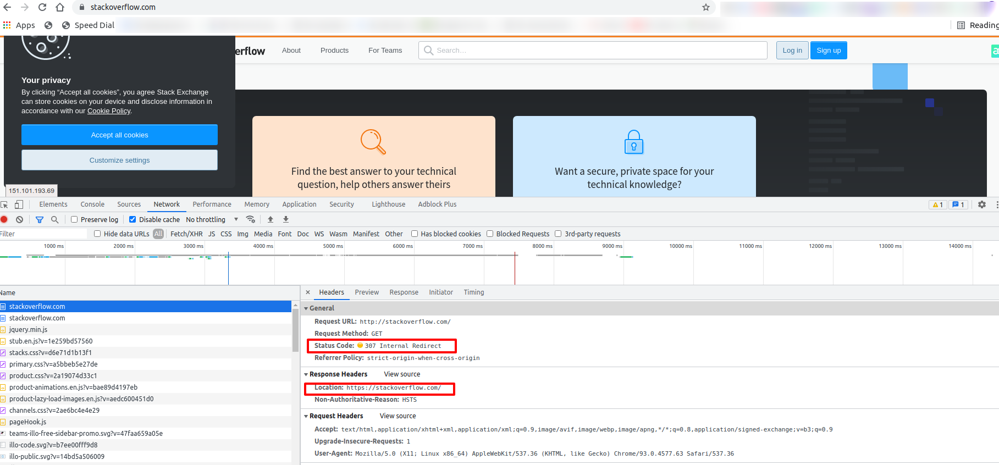
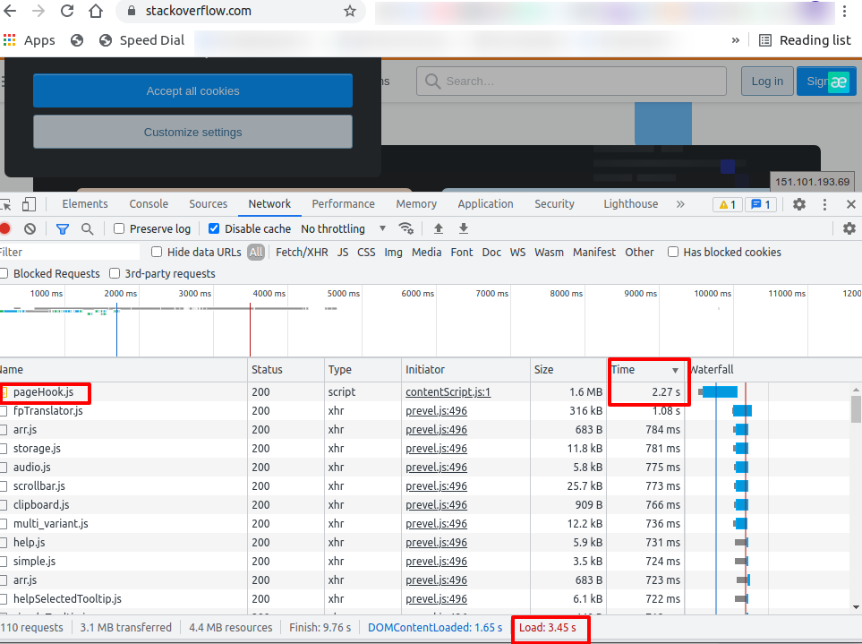

# Домашнее задание к занятию "3.6. Компьютерные сети, лекция 1"

1. Работа c HTTP через телнет.
- Подключитесь утилитой телнет к сайту stackoverflow.com
`telnet stackoverflow.com 80`
- отправьте HTTP запрос
```bash
GET /questions HTTP/1.0
HOST: stackoverflow.com
[press enter]
[press enter]
```
- В ответе укажите полученный HTTP код, что он означает?

  ```bash
  # telnet stackoverflow.com 80
  ```
  ```
  Trying 151.101.129.69...
  Connected to stackoverflow.com.
  Escape character is '^]'.
  ```

  ```bash
  GET /questions HTTP/1.0
  HOST: stackoverflow.com
  ```
  ```bash
  HTTP/1.1 301 Moved Permanently
  location: https://stackoverflow.com/questions
  ```
  Код ответа `301`

  "Перемещён на постоянной основе". Этот код ответа значит, что URI запрашиваемого ресурса был изменён

  Происходит перенаправление(http->https) `http://stackoverflow.com/questions->https://stackoverflow.com/questions`

2. Повторите задание 1 в браузере, используя консоль разработчика F12.
- откройте вкладку `Network`
- отправьте запрос http://stackoverflow.com
- найдите первый ответ HTTP сервера, откройте вкладку `Headers`
- укажите в ответе полученный HTTP код.
- проверьте время загрузки страницы, какой запрос обрабатывался дольше всего?
- приложите скриншот консоли браузера в ответ.

    HTTP Response Code:

    

    Код ответа `307` - `Temporary Redirect`

    Происходит редирект путем добавления закрывающего слеша и смены протокола с http на https

    т.е. `http://stackoverflow.com->https://stackoverflow.com/`

    HTTP Load Time:

    

    Время загрузки страницы  - 3,45с

    Самый долго обрабатывающийся запрос -  `/pageHook.js` - 2,27c

3. Какой IP адрес у вас в интернете?

    ```bash
    # curl ifconfig.io
    159.224.38.182
    ```
    ```bash
    # curl http://checkip.amazonaws.com/
    159.224.38.182
    ```

4. Какому провайдеру принадлежит ваш IP адрес? Какой автономной системе AS? Воспользуйтесь утилитой `whois`

    Провайдер - `Триолан`

    Автономная система  - `AS13188`

    ```bash
    # whois -h whois.ripe.net 159.224.38.182 | grep -E 'inetnum|netname|origin'
    inetnum:        159.224.38.0 - 159.224.38.255
    netname:        TRIOLAN
    origin:         AS13188
    ```

5. Через какие сети проходит пакет, отправленный с вашего компьютера на адрес 8.8.8.8? Через какие AS? Воспользуйтесь утилитой `traceroute`

    ```bash
    # traceroute -A -n 8.8.8.8
    traceroute to 8.8.8.8 (8.8.8.8), 30 hops max, 60 byte packets
     1  192.168.1.1 [*]  0.614 ms  0.771 ms  0.956 ms
     2  159.224.38.254 [AS13188]  3.802 ms  4.114 ms  4.255 ms
     3  10.25.1.25 [*]  3.617 ms  3.784 ms  3.835 ms
     4  10.241.241.241 [*]  17.819 ms  24.404 ms  24.423 ms
     5  142.250.163.136 [AS15169]  10.533 ms  9.441 ms  9.595 ms
     6  108.170.248.155 [AS15169]  9.775 ms 108.170.248.138 [AS15169]  7.395 ms  7.496 ms
     7  142.250.228.86 [AS15169]  21.178 ms  21.260 ms  21.278 ms
     8  142.251.67.63 [AS15169]  37.626 ms 74.125.242.241 [AS15169]  21.496 ms 74.125.242.225 [AS15169]  22.705 ms
     9  74.125.242.225 [AS15169]  22.732 ms 216.239.35.185 [AS15169]  24.487 ms 142.251.65.221 [AS15169]  21.954 ms
    10  142.251.65.217 [AS15169]  22.031 ms 8.8.8.8 [AS15169]  22.177 ms 216.239.35.185 [AS15169]  24.497 ms
    ```

6. Повторите задание 5 в утилите `mtr`. На каком участке наибольшая задержка - delay?

    Наибольшая задержка на хопе/маршрутизаторе с IP-адресом 10.241.241.241

    ```bash
    # mtr -r -z -n 8.8.8.8
    Start: 2021-09-12T19:19:40+0300
    HOST: eugene-notebook             Loss%   Snt   Last   Avg  Best  Wrst StDev
      1. AS???    192.168.1.1          0.0%    10    0.5   0.6   0.4   0.9   0.1
      2. AS13188  159.224.38.254       0.0%    10    1.5   9.5   1.2  81.5  25.3
      3. AS???    10.25.1.25           0.0%    10    1.4   2.1   1.2   8.5   2.3
      4. AS???    10.241.241.241       0.0%    10    1.3  98.3   1.3 344.2 141.0
      5. AS15169  142.250.163.136      0.0%    10   53.2  13.4   7.2  53.2  14.2
      6. AS15169  108.170.248.138      0.0%    10    7.4   7.5   7.4   8.5   0.3
      7. AS15169  142.250.228.86       0.0%    10   41.4  23.1  20.7  41.4   6.5
      8. AS15169  74.125.242.241       0.0%    10   20.7  20.7  20.6  20.8   0.0
      9. AS15169  142.251.65.223       0.0%    10   20.7  20.7  20.6  20.8   0.1
     10. AS15169  8.8.8.8              0.0%    10   20.5  20.9  20.5  23.7   1.0
     ```

7. Какие DNS сервера отвечают за доменное имя dns.google? Какие A записи? воспользуйтесь утилитой `dig`

    ```bash
    # dig +short NS dns.google
    ns3.zdns.google.
    ns2.zdns.google.
    ns1.zdns.google.
    ns4.zdns.google.
    ```

    ```bash
    # for i in {1..4}; do echo ns$i.zdns.google; dig +short ns$i.zdns.google; echo ""; done
    for i in {1..4}; do echo ns$i.zdns.google; dig +short ns$i.zdns.google; echo ""; done
    ns1.zdns.google
    216.239.32.114

    ns2.zdns.google
    216.239.34.114

    ns3.zdns.google
    216.239.36.114

    ns4.zdns.google
    216.239.38.114
    ```


8. Проверьте PTR записи для IP адресов из задания 7. Какое доменное имя привязано к IP? воспользуйтесь утилитой `dig`

   ```bash
   # dig +short -x 216.239.32.114
   ns1.zdns.google.
   ```
