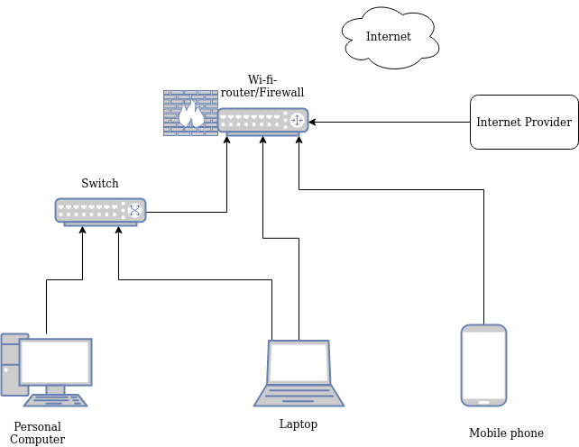

# Домашнее задание к занятию "3.8. Компьютерные сети, лекция 3"

1. Подключитесь к публичному маршрутизатору в интернет. Найдите маршрут к вашему публичному IP
```
telnet route-views.routeviews.org
Username: rviews
show ip route x.x.x.x/32
show bgp x.x.x.x/32
```
```bash
telnet route-views.routeviews.org
```
```bash
Trying 128.223.51.103...
Connected to route-views.routeviews.org.

To login, use the username "rviews".

 **********************************************************************


User Access Verification

Username: rviews
route-views>
```
```bash
route-views>show ip route 159.224.38.182
```
```bash
Routing entry for 159.224.38.0/24
  Known via "bgp 6447", distance 20, metric 0
  Tag 6939, type external
  Last update from 64.71.137.241 4d08h ago
  Routing Descriptor Blocks:
  * 64.71.137.241, from 64.71.137.241, 4d08h ago
      Route metric is 0, traffic share count is 1
      AS Hops 2
      Route tag 6939
      MPLS label: none
```
```bash
route-views>show bgp 159.224.38.182
```
```bash
BGP routing table entry for 159.224.38.0/24, version 1052540554
Paths: (22 available, best #4, table default)
  Not advertised to any peer
  Refresh Epoch 1
  3267 6939 13188
    194.85.40.15 from 194.85.40.15 (185.141.126.1)
      Origin IGP, metric 0, localpref 100, valid, external
      path 7FE0B9FA4050 RPKI State valid
      rx pathid: 0, tx pathid: 0
  Refresh Epoch 2
  3303 6939 13188
    217.192.89.50 from 217.192.89.50 (138.187.128.158)
      Origin IGP, localpref 100, valid, external
      Community: 3303:1006 3303:1021 3303:1030 3303:3067 6939:1000 6939:7257 6939:8804 6939:9002
      path 7FE09E99DCD8 RPKI State valid
      rx pathid: 0, tx pathid: 0
  Refresh Epoch 1
  701 6939 13188
    137.39.3.55 from 137.39.3.55 (137.39.3.55)
      Origin IGP, localpref 100, valid, external
      path 7FE0D1C361E8 RPKI State valid
      rx pathid: 0, tx pathid: 0
  Refresh Epoch 1
  6939 13188
    64.71.137.241 from 64.71.137.241 (216.218.252.164)
      Origin IGP, localpref 100, valid, external, best
      path 7FE153BCB118 RPKI State valid
      rx pathid: 0, tx pathid: 0x0
.......
```

2. Создайте dummy0 интерфейс в Ubuntu. Добавьте несколько статических маршрутов. Проверьте таблицу маршрутизации.

Загружаем модуль ядра `dummy` для поддержки работы `dummy`-интерфейса

Также можно добавить опцию `numdummies=2`, чтобы сразу создалось два интерфейса `dummyX`

```bash
# modprobe -v dummy numdummies=2
insmod /lib/modules/5.4.0-80-generic/kernel/drivers/net/dummy.ko numdummies=2 numdummies=0 numdummies=2
```

Проверяем подгрузку модуля dummy:
```bash
# lsmod | grep dummy
dummy                  16384  0
```

Проверяем наличие созданных dummy-интерфейсы
```bash
# ip a sh | grep dummy
3: dummy0: <BROADCAST,NOARP> mtu 1500 qdisc noop state DOWN group default qlen 1000
4: dummy1: <BROADCAST,NOARP> mtu 1500 qdisc noop state DOWN group default qlen 1000
```


Настраиваем dummy-интерфейсы
```bash
cat <<EOF >> /etc/network/interfaces
auto dummy0
iface dummy0 inet static
   address 10.10.20.2/32
   pre-up ip link add dummy0 type dummy
   post-down ip link del dummy0
auto dummy1
iface dummy1 inet static
   address 10.10.21.2/32
   pre-up ip link add dummy1 type dummy
   post-down ip link del dummy1
EOF
```

Применяем наши настройки и активируем/поднимаем dummy-интерфейсы
```bash
# systemctl restart networking
```

Проверяем наличие поднятых dummy{0..1}-интерфейсов
```bash
# ip  a sh | grep -A5 dummy
3: dummy0: <BROADCAST,NOARP,UP,LOWER_UP> mtu 1500 qdisc noqueue state UNKNOWN group default qlen 1000
    link/ether e6:b9:f1:6f:56:16 brd ff:ff:ff:ff:ff:ff
    inet 10.10.20.2/32 brd 10.10.20.2 scope global dummy0
       valid_lft forever preferred_lft forever
    inet6 fe80::e4b9:f1ff:fe6f:5616/64 scope link
       valid_lft forever preferred_lft forever
4: dummy1: <BROADCAST,NOARP,UP,LOWER_UP> mtu 1500 qdisc noqueue state UNKNOWN group default qlen 1000
    link/ether ce:61:8f:6c:53:b2 brd ff:ff:ff:ff:ff:ff
    inet 10.10.21.2/32 brd 10.10.21.2 scope global dummy1
       valid_lft forever preferred_lft forever
    inet6 fe80::cc61:8fff:fe6c:53b2/64 scope link
       valid_lft forever preferred_lft forever
```

Проверяем доступность IP-адресов назначенных на dummy{0..1}-интерфейсы по icmp-протоколу
```bash
# for i in {0..1}; do echo dummy$i; ping -c 3 10.10.2$i.2; done
dummy0
PING 10.10.20.2 (10.10.20.2) 56(84) bytes of data.
64 bytes from 10.10.20.2: icmp_seq=1 ttl=64 time=0.183 ms
64 bytes from 10.10.20.2: icmp_seq=2 ttl=64 time=0.043 ms
64 bytes from 10.10.20.2: icmp_seq=3 ttl=64 time=0.063 ms

--- 10.10.20.2 ping statistics ---
3 packets transmitted, 3 received, 0% packet loss, time 2038ms
rtt min/avg/max/mdev = 0.043/0.096/0.183/0.061 ms
dummy1
PING 10.10.21.2 (10.10.21.2) 56(84) bytes of data.
64 bytes from 10.10.21.2: icmp_seq=1 ttl=64 time=0.046 ms
64 bytes from 10.10.21.2: icmp_seq=2 ttl=64 time=0.085 ms
64 bytes from 10.10.21.2: icmp_seq=3 ttl=64 time=0.064 ms

--- 10.10.21.2 ping statistics ---
3 packets transmitted, 3 received, 0% packet loss, time 2043ms
rtt min/avg/max/mdev = 0.046/0.065/0.085/0.015 ms
```
Добавьте несколько статических маршрутов.

```bash
# ip r sh
default via 10.0.2.2 dev eth0 proto dhcp src 10.0.2.15 metric 100
10.0.2.0/24 dev eth0 proto kernel scope link src 10.0.2.15
10.0.2.2 dev eth0 proto dhcp scope link src 10.0.2.15 metric 100
```

Для Ubuntu 18+ добавляем статические маршруты через `netplan`

Добавляем блок routes c нужными маршрутами:
```bash
# cat /etc/netplan/01-netcfg.yaml
network:
  version: 2
  ethernets:
    eth0:
    ....
      routes:
        - to: 192.168.2.0/24
          via: 10.0.2.10
          metric: 100
        - to: 192.168.10.100
          via: 10.0.2.10
          metric: 100
```
Перегружаем `netplan` конфигурацию для применения настроек:
```bash
# netplan apply
```

Для Ubuntu 14-16 настраиваем статические маршруты в файле `/etc/network/interfaces`
```bash
# cat  /etc/network/interfaces
auto eth0
iface eth0 inet static
   address 10.0.2.15
   netmask 255.255.255.0
   gateway 10.0.2.2
   up route add -net 192.168.2.0 netmask 255.255.255.0 gw 10.0.2.10
   up route add -net 192.168.10.100 netmask 255.255.255.255 gw 10.0.2.10
```

Проверяем таблицу маршрутизации.
```bash
# ip r sh
default via 10.0.2.2 dev eth0 proto dhcp src 10.0.2.15 metric 100
10.0.2.0/24 dev eth0 proto kernel scope link src 10.0.2.15
10.0.2.2 dev eth0 proto dhcp scope link src 10.0.2.15 metric 100
192.168.2.0/24 via 10.0.2.10 dev eth0 proto static metric 100 onlink
192.168.10.100 via 10.0.2.10 dev eth0 proto static metric 100 onlink
```

3. Проверьте открытые TCP порты в Ubuntu, какие протоколы и приложения используют эти порты? Приведите несколько примеров.
```bash
# ss -tlnp
State     Recv-Q    Send-Q         Local Address:Port         Peer Address:Port    Process
LISTEN    0         4096           127.0.0.53%lo:53                0.0.0.0:*        users:(("systemd-resolve",pid=570,fd=13))
LISTEN    0         128                  0.0.0.0:22                0.0.0.0:*        users:(("sshd",pid=667,fd=3))
LISTEN    0         4096                 0.0.0.0:111               0.0.0.0:*        users:(("rpcbind",pid=568,fd=4),("systemd",pid=1,fd=42))
LISTEN    0         128                     [::]:22                   [::]:*        users:(("sshd",pid=667,fd=4))
LISTEN    0         4096                    [::]:111                  [::]:*        users:(("rpcbind",pid=568,fd=6),("systemd",pid=1,fd=44))
```

4. Проверьте используемые UDP сокеты в Ubuntu, какие протоколы и приложения используют эти порты?
```bash
# ss -ulnp
State     Recv-Q    Send-Q         Local Address:Port         Peer Address:Port    Process
UNCONN    0         0              127.0.0.53%lo:53                0.0.0.0:*        users:(("systemd-resolve",pid=570,fd=12))
UNCONN    0         0             10.0.2.15%eth0:68                0.0.0.0:*        users:(("systemd-network",pid=1193,fd=20))
UNCONN    0         0                    0.0.0.0:111               0.0.0.0:*        users:(("rpcbind",pid=568,fd=5),("systemd",pid=1,fd=43))
UNCONN    0         0                       [::]:111                  [::]:*        users:(("rpcbind",pid=568,fd=7),("systemd",pid=1,fd=45))
```

`127.0.0.53%lo:53` - `systemd-resolve`-сервис - локальный DNS-сервер использует TCP и UDP 53-порт
```bash
# grep 127 /etc/resolv.conf
nameserver 127.0.0.53
```

`0.0.0.0:22`

`[::]:22`

SSH-сервис на IPv4 и IPv6-протоколах

```bash
# grep -w Port /etc/ssh/sshd_config
#Port 22
```

`10.0.2.15%eth0:68`

Network-сервис, который настраивает сетевой интерфейс через DHCP-клиент

```bash
# grep -i dhcp /etc/netplan/01-netcfg.yaml
      dhcp4: true
```


`0.0.0.0:111`

`[::]:111`

RPCbind(Remote Procedure Call Bind) сервис на IPv4 и IPv6-протоколах для TCP и UDP-портов


5. Используя diagrams.net, создайте L3 диаграмму вашей домашней сети или любой другой сети, с которой вы работали.



 ---
## Задание для самостоятельной отработки (необязательно к выполнению)

6*. Установите Nginx, настройте в режиме балансировщика TCP или UDP.

7*. Установите bird2, настройте динамический протокол маршрутизации RIP.

8*. Установите Netbox, создайте несколько IP префиксов, используя curl проверьте работу API.
