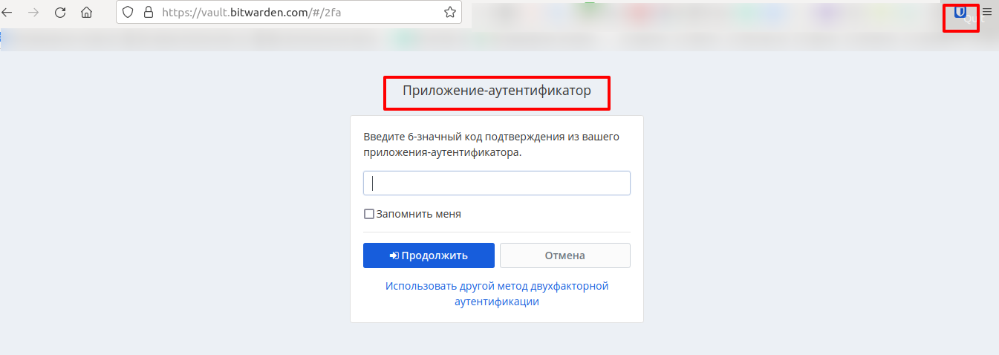
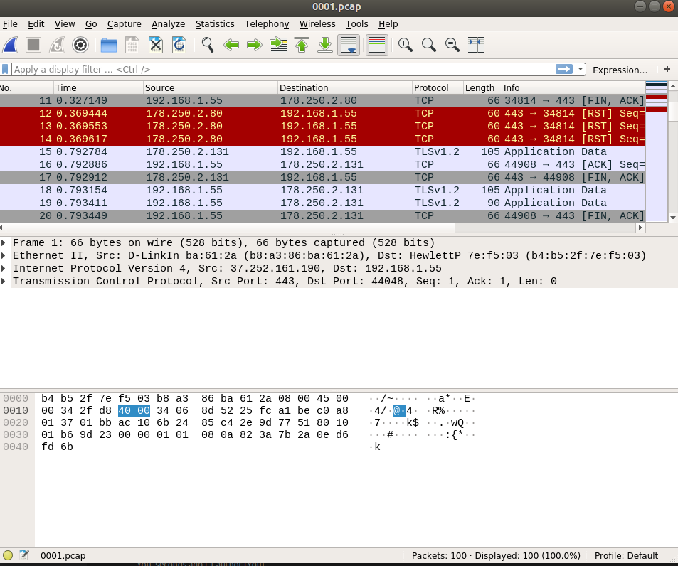

# Домашнее задание к занятию "3.9. Элементы безопасности информационных систем"

1. Установите Bitwarden плагин для браузера. Зарегестрируйтесь и сохраните несколько паролей.

2. Установите Google authenticator на мобильный телефон. Настройте вход в Bitwarden акаунт через Google authenticator OTP.


3. Установите apache2, сгенерируйте самоподписанный сертификат, настройте тестовый сайт для работы по HTTPS.

    Устанавливаем Apache
    ```bash
    # apt-get update && apt-get install apache2 -y
    ```

    Генерируем самоподписной сертификат
    ```bash
    # openssl req -x509 -nodes -days 3650 -newkey rsa:2048 \
    -keyout /etc/ssl/private/apache-selfsigned.key \
    -out /etc/ssl/certs/apache-selfsigned.crt \
    -subj "/C=UA/ST=Kharkov/L=Kharkov/O=MyIT/OU=OT-Department/CN=localhost"
    ```
    Проверяем созданные сертификат и приватный ключ
    ```bash
    # ls -al /etc/ssl/private/apache-selfsigned.key /etc/ssl/certs/apache-selfsigned.crt
    -rw-r--r-- 1 root root 1350 Oct  3 21:08 /etc/ssl/certs/apache-selfsigned.crt
    -rw------- 1 root root 1704 Oct  3 21:08 /etc/ssl/private/apache-selfsigned.key
    ```

    Создаем конфигурационный файл виртуального хоста
    ```bash
    cat << EOF > /etc/apache2/sites-available/localhost.conf
    <VirtualHost *:443>
    ServerName localhost
    DocumentRoot /var/www/localhost
    SSLEngine on
    SSLCertificateFile /etc/ssl/certs/apache-selfsigned.crt
    SSLCertificateKeyFile /etc/ssl/private/apache-selfsigned.key
    </VirtualHost>
    EOF
    ```

    Создаем DocumentRoot и индексную страницу
    ```bash
    # mkdir /var/www/localhost
    # echo '<h1>it worked!</h1>' >  /var/www/localhost/index.html
    ```
    Включаем/активируем SSL-модуль Apache
    ```bash
    # a2enmod ssl
    ```

    Включаем созданный виртуальный хост
    ```bash
    # a2ensite localhost.conf
    Enabling site localhost.
    To activate the new configuration, you need to run:
      systemctl reload apache2
    ```
    Проверяем синтаксис конфигурационного файла виртуального хоста
    ```bash
    # apache2ctl configtest
    Syntax OK
    ```

    Перчитываем конфигурацию Apache, чтобы применить настройки созданного виртуального хоста
    ```bash
    # systemctl reload apache2
    ```

    Проверяем доступность сайта по https-протоколу
    и ожидаемо получаем ошибку установки соединения т.к. сертификат самоподписной
    ```bash
    # curl  https://localhost
    curl: (60) SSL certificate problem: self signed certificate
    More details here: https://curl.haxx.se/docs/sslcerts.html

    curl failed to verify the legitimacy of the server and therefore could not
    establish a secure connection to it. To learn more about this situation and
    how to fix it, please visit the web page mentioned above.
    ```

    Игнорируем проверку сертификата(ключ -k)
    ```bash
    # curl -k  https://localhost
    <h1>it worked!</h1>
    ```
4. Проверьте на TLS уязвимости произвольный сайт в интернете.
    ```bash
    # git clone --depth 1 https://github.com/drwetter/testssl.sh.git
    ```
    ```bash
    # cd testssl.sh/
    ```
    Быстрая проверка сайта
    ```bash
    # ./testssl.sh -e --quiet --fast --parallel https://kamaok.org.ua

     Start 2021-10-03 21:51:41        -->> 80.240.142.135:443 (kamaok.org.ua) <<--

     rDNS (80.240.142.135):  server1.kamaok.org.ua.
     Service detected:       HTTP


     Testing all 183 locally available ciphers against the server, ordered by encryption strength


    Hexcode  Cipher Suite Name (OpenSSL)       KeyExch.   Encryption  Bits     Cipher Suite Name (IANA/RFC)
    -----------------------------------------------------------------------------------------------------------------------------
     xc030   ECDHE-RSA-AES256-GCM-SHA384       ECDH 256   AESGCM      256      TLS_ECDHE_RSA_WITH_AES_256_GCM_SHA384
     x9f     DHE-RSA-AES256-GCM-SHA384         DH 2048    AESGCM      256      TLS_DHE_RSA_WITH_AES_256_GCM_SHA384
     xc02f   ECDHE-RSA-AES128-GCM-SHA256       ECDH 256   AESGCM      128      TLS_ECDHE_RSA_WITH_AES_128_GCM_SHA256
     x9e     DHE-RSA-AES128-GCM-SHA256         DH 2048    AESGCM      128      TLS_DHE_RSA_WITH_AES_128_GCM_SHA256
    ```

    Используемые опции:

    * `--mode <serial|parallel>`  - Mass testing to be done serial (default) or parallel (--parallel is shortcut for the latter)

    * `-e, --each-cipher`         - checks each local cipher remotely

    * `--fast`                    - omits some checks: using openssl for all ciphers (-e), show only first preferred cipher

    * `--quiet`                   - don't output the banner. By doing this you acknowledge usage terms normally appearing in the banner

    Проверка сайта на уязвимость

    `-U, --vulnerable`            - tests all vulnerabilities (if applicable)

    ```bash
    # ./testssl.sh --quiet --vulnerable --sneaky https://kamaok.org.ua/

     Start 2021-10-03 21:54:10        -->> 80.240.142.135:443 (kamaok.org.ua) <<--

     rDNS (80.240.142.135):  server1.kamaok.org.ua.
     Service detected:       HTTP


     Testing vulnerabilities

     Heartbleed (CVE-2014-0160)                not vulnerable (OK), timed out
     CCS (CVE-2014-0224)                       not vulnerable (OK)
     Ticketbleed (CVE-2016-9244), experiment.  not vulnerable (OK), no session ticket extension
     ROBOT                                     Server does not support any cipher suites that use RSA key transport
     Secure Renegotiation (RFC 5746)           supported (OK)
     Secure Client-Initiated Renegotiation     not vulnerable (OK)
     CRIME, TLS (CVE-2012-4929)                not vulnerable (OK)
     BREACH (CVE-2013-3587)                    potentially NOT ok, "gzip" HTTP compression detected. - only supplied "/" tested
                                               Can be ignored for static pages or if no secrets in the page
     POODLE, SSL (CVE-2014-3566)               not vulnerable (OK)
     TLS_FALLBACK_SCSV (RFC 7507)              No fallback possible (OK), no protocol below TLS 1.2 offered
     SWEET32 (CVE-2016-2183, CVE-2016-6329)    not vulnerable (OK)
     FREAK (CVE-2015-0204)                     not vulnerable (OK)
     DROWN (CVE-2016-0800, CVE-2016-0703)      not vulnerable on this host and port (OK)
                                               make sure you don't use this certificate elsewhere with SSLv2 enabled services
                                               https://censys.io/ipv4?q=6A25885BD5F38E6BEC5892C8FD01B09BB2C894C2A72A2F554E2CD87E94B68143 could help you to     find out
     LOGJAM (CVE-2015-4000), experimental      not vulnerable (OK): no DH EXPORT ciphers, no common prime detected
     BEAST (CVE-2011-3389)                     not vulnerable (OK), no SSL3 or TLS1
     LUCKY13 (CVE-2013-0169), experimental     not vulnerable (OK)
     Winshock (CVE-2014-6321), experimental    not vulnerable (OK) - CAMELLIA or ECDHE_RSA GCM ciphers found
     RC4 (CVE-2013-2566, CVE-2015-2808)        no RC4 ciphers detected (OK)


     Done 2021-10-03 21:54:52 [  45s] -->> 80.240.142.135:443 (kamaok.org.ua) <<--
    ```

    Используемые опции:
    * `--quiet`        - do not output the banner. By doing this you acknowledge usage terms normally appearing in the banner

    * `--vulnerable`   - tests all vulnerabilities (if applicable)

    * `--sneaky`       - leave less traces in target logs: user agent, referer

5. Установите на Ubuntu ssh сервер, сгенерируйте новый приватный ключ. Скопируйте свой публичный ключ на другой сервер. Подключитесь к серверу по SSH-ключу.

    ```bash
    # apt-get update && apt-get install openssh-server -y
    ```
    ```bash
    # ssh-keygen -t rsa -b 4096 -N "" -f ~/.ssh/id_rsa
    Generating public/private rsa key pair.
    Created directory '/root/.ssh'.
    Your identification has been saved in /root/.ssh/id_rsa
    Your public key has been saved in /root/.ssh/id_rsa.pub
    The key fingerprint is:
    SHA256:SpjCUbu5x+61yByMw3tieXfLMDVaQrhe1PNkWoGxDcg root@vagrant
    The key's randomart image is:
    +---[RSA 4096]----+
    |    .  . .oo.    |
    |   . . .E..+ .   |
    |  . . . o + =    |
    | . . = +   B     |
    |  o = o S = .    |
    |   o B o = .     |
    |    =.B =        |
    |    +Bo+.=.      |
    |   ..=*...o.     |
    +----[SHA256]-----+
    ```

    Добавляем публичный ключ на удаленный сервер в файл ~/.ssh/authorized_keys
    ```bash
    # ssh-copy-id  root@80.240.142.135
    /usr/bin/ssh-copy-id: INFO: Source of key(s) to be installed: "/root/.ssh/id_rsa.pub"
    The authenticity of host '[80.240.142.135]:22 ([80.240.142.135]:22)' can't be established.
    RSA key fingerprint is SHA256:JftgUE1s+yLnCO5iHJCy1W0cV5LRouXrQ6vmxD1dEpk.
    Are you sure you want to continue connecting (yes/no/[fingerprint])? yes
    /usr/bin/ssh-copy-id: INFO: attempting to log in with the new key(s), to filter out any that are already installed
    /usr/bin/ssh-copy-id: INFO: 1 key(s) remain to be installed -- if you are prompted now it is to install the new keys
    root@80.240.142.135's password:

    Number of key(s) added: 1

    Now try logging into the machine, with:   "ssh 'root@80.240.142.135'"
    and check to make sure that only the key(s) you wanted were added.
    ````
    Проверяем успешное беспарольное подключение по SSH-ключу

    ```bash
    # ssh root@80.240.142.135
    Last login: Mon Oct  4 00:32:58 2021 from 159.224.38.182
    [root@server1 ~]#
    ```

6. Переименуйте файлы ключей из задания 5. Настройте файл конфигурации SSH клиента, так чтобы вход на удаленный сервер осуществлялся по имени сервера.
    ```bash
    # mv ~/.ssh/id_rsa ~/.ssh/id_rsa_new
    ```
    ```bash
    # mv ~/.ssh/id_rsa.pub ~/.ssh/id_rsa_new.pub
    ```
    ```bash
    # ls -l ~/.ssh/
    total 12
    -rw------- 1 root root 3381 Oct  3 22:12 id_rsa_new
    -rw-r--r-- 1 root root  738 Oct  3 22:12 id_rsa_new.pub
    -rw-r--r-- 1 root root  442 Oct  3 22:15 known_hosts
    ```

    Настраиваем конфиг SSH-клиента
    ```bash
    # nano ~/.ssh/config
    Host myserver
      Hostname 80.240.142.135
      IdentityFile ~/.ssh/id_rsa_new
      IdentitiesOnly yes
      User root
      Port 22
    ```
    Проверяем доступ по SSH по имени, указанным в конфигурационном файле SSH-клиента
    ```bash
    # ssh myserver
    Last login: Mon Oct  4 01:17:45 2021 from 159.224.38.182
    ```
    ```bash
    [root@server1 ~]# curl ifconfig.io
    80.240.142.135
    ```

    Подключение с командной строки с нестандартным SSH-приватным ключем
    ```bash
    # ssh -i ~/.ssh/id_rsa_new root@80.240.142.135
    Last login: Mon Oct  4 01:23:16 2021 from 159.224.38.182
    [root@server1 ~]#
    ```


7. Соберите дамп трафика утилитой tcpdump в формате pcap, 100 пакетов. Откройте файл pcap в Wireshark.

    ```bash
    # apt-get update && apt-get install wireshark -y
    ```
    ```bash
    # sudo tcpdump -n -nn -i enp4s0 -c 100 port 443 -w 0001.pcap
    tcpdump: listening on enp4s0, link-type EN10MB (Ethernet), capture size 262144 bytes
    100 packets captured
    122 packets received by filter
    0 packets dropped by kernel
    ```
    ```bash
    # sudo wireshark -r 0001.pcap
    QStandardPaths: XDG_RUNTIME_DIR not set, defaulting to '/tmp/runtime-root'
    ```
    

## Задание для самостоятельной отработки (необязательно к выполнению)

8*. Просканируйте хост scanme.nmap.org. Какие сервисы запущены?

  ```bash
  # sudo nmap -O scanme.nmap.org
  Starting Nmap 7.60 ( https://nmap.org ) at 2021-10-09 23:22 EEST
  Nmap scan report for scanme.nmap.org (45.33.32.156)
  Host is up (0.17s latency).
  Other addresses for scanme.nmap.org (not scanned): 2600:3c01::f03c:91ff:fe18:bb2f
  Not shown: 995 closed ports
  PORT      STATE    SERVICE
  22/tcp    open     ssh
  80/tcp    open     http
  646/tcp   filtered ldp
  9929/tcp  open     nping-echo
  31337/tcp open     Elite
  ```


9*. Установите и настройте фаервол ufw на web-сервер из задания 3. Откройте доступ снаружи только к портам 22,80,443
  ```bash
  # apt-get update && apt-get install ufw
  ```
  ```bash
  # ufw allow proto tcp from any to any port 22,80,443
  Rules updated
  Rules updated (v6)
  ```
  ```bash
  # ufw logging on
  Logging enabled
  ```
  ```bash
  # ufw enable
  Command may disrupt existing ssh connections. Proceed with operation (y|n)? y
  Firewall is active and enabled on system startup
  ```
  ```bash
  # ufw status verbose
  Status: active
  Logging: on (low)
  Default: deny (incoming), allow (outgoing), disabled (routed)
  New profiles: skip
  To                         Action      From
  --                         ------      ----
  22,80,443/tcp              ALLOW IN    Anywhere
  22,80,443/tcp (v6)         ALLOW IN    Anywhere (v6)
  ```