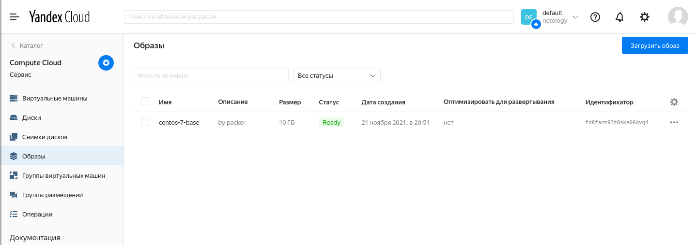
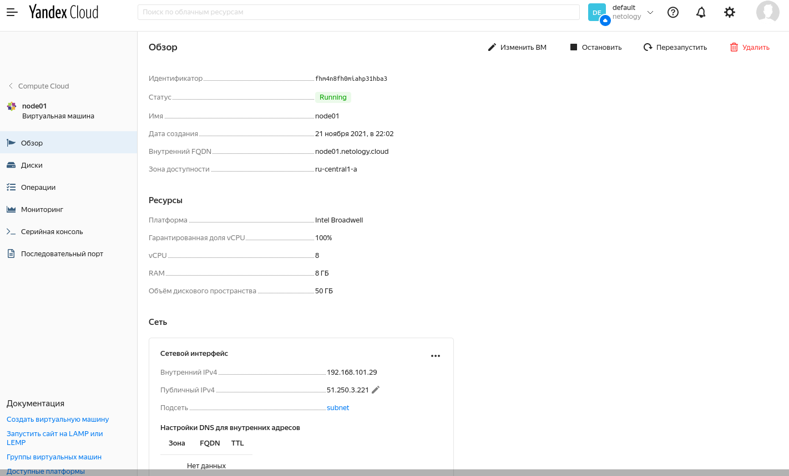
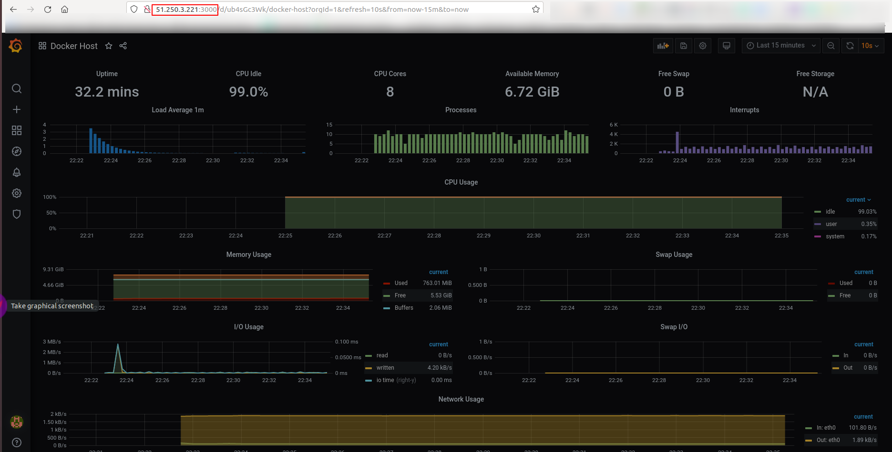
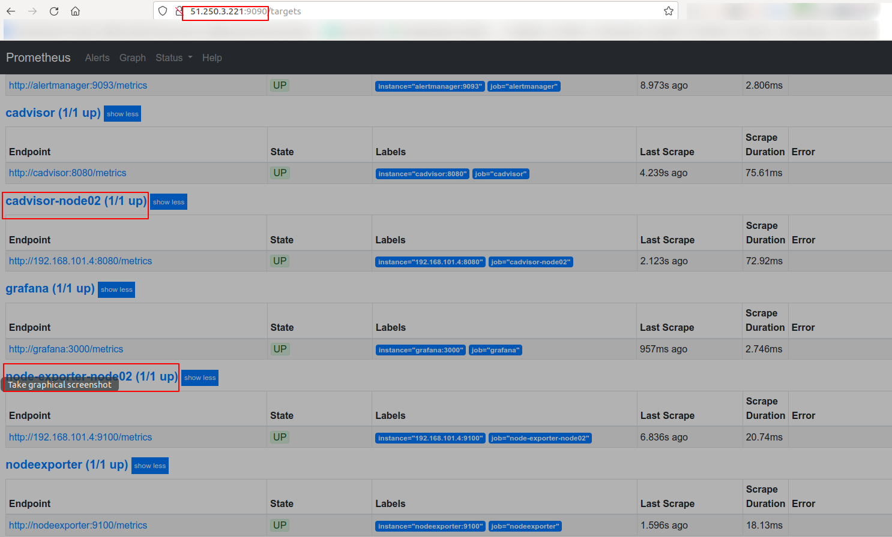

# Домашнее задание к занятию "5.4. Оркестрация группой Docker контейнеров на примере Docker Compose"

## Задача 1

Создать собственный образ операционной системы с помощью Packer.

Для получения зачета, вам необходимо предоставить:
- Скриншот страницы, как на слайде из презентации (слайд 37).

Answer:

```bash
# yc compute image list
+----------------------+---------------+--------+----------------------+--------+
|          ID          |     NAME      | FAMILY |     PRODUCT IDS      | STATUS |
+----------------------+---------------+--------+----------------------+--------+
| fd8farm93t8ska08qvq4 | centos-7-base | centos | f2ebfhrshe5m6i4saf1j | READY  |
+----------------------+---------------+--------+----------------------+--------+
```

## Задача 2

Создать вашу первую виртуальную машину в Яндекс.Облаке.

Для получения зачета, вам необходимо предоставить:
- Скриншот страницы свойств созданной ВМ, как на примере ниже:

<p align="center">
  
</p>


Answer:


## Задача 3

Создать ваш первый готовый к боевой эксплуатации компонент мониторинга, состоящий из стека микросервисов.

Для получения зачета, вам необходимо предоставить:
- Скриншот работающего веб-интерфейса Grafana с текущими метриками, как на примере ниже
<p align="center">
  
</p>


Answer:

## Задача 4 (*)

Создать вторую ВМ и подключить её к мониторингу развёрнутому на первом сервере.

Для получения зачета, вам необходимо предоставить:
- Скриншот из Grafana, на котором будут отображаться метрики добавленного вами сервера.

Представляю скриншот с Prometheus, в котором видно, что с node-exporter/cadvisor со второй ноды метрики собираются успешно

Для скриншота  с Grafana нужно переделывать dashboard путем добавления  переменных в дашбоард, чтобы
появилась возможность выбирать хост, для которого нужно отображать метрики

Answer:



## Пошаговый план выполнения этой домашней работы

### Установка утилиты `yc`, инициализация профиля, создание сети и подсети

Установка утилиты Yandex Cloud `yc`

https://cloud.yandex.ru/docs/cli/quickstart

```bash
# curl https://storage.yandexcloud.net/yandexcloud-yc/install.sh | bash
```
```bash
# source ~/.bashrc
```
```bash
# yc --version
Yandex.Cloud CLI 0.84.0 linux/amd64
```

https://cloud.yandex.ru/docs/cli/quickstart

Регистрируемся в консоли Yandex Cloud после чего получаем `OAuth`-токен


Инициализация профиля
```bash
# yc init
Welcome! This command will take you through the configuration process.
Please go to https://oauth.yandex.ru/authorize?response_type=token&client_id=1a6990aa636648e9b2ef855fa7bec2fb in order to obtain OAuth token.

Please enter OAuth token: AQAAAAAOep*********************
You have one cloud available: 'netology' (id = b1gffbafdo7prn8rdsdt). It is going to be used by default.
Please choose folder to use:
 [1] default (id = b1gvtndpj707oc5sjqj9)
 [2] Create a new folder
Please enter your numeric choice: 1
Your current folder has been set to 'default' (id = b1gvtndpj707oc5sjqj9).
Do you want to configure a default Compute zone? [Y/n] y
Which zone do you want to use as a profile default?
 [1] ru-central1-a
 [2] ru-central1-b
 [3] ru-central1-c
 [4] Don't set default zone
Please enter your numeric choice: 1
Your profile default Compute zone has been set to 'ru-central1-a'.
```

Проверяем настройки профиля CLI:

```bash
# yc config list
token: AQAAAAAOep*********************
cloud-id: b1gffbafdo7prn8rdsdt
folder-id: b1gvtndpj707oc5sjqj9
compute-default-zone: ru-central1-a
```

```bash
# yc compute image list
+----+------+--------+-------------+--------+
| ID | NAME | FAMILY | PRODUCT IDS | STATUS |
+----+------+--------+-------------+--------+
+----+------+--------+-------------+--------+
```

Создание сети
```bash
# yc vpc network create \
--name net \
--labels my-label=netology \
--description "my first network via yc"
id: enpp0t4no5apinqdvq4n
folder_id: b1gvtndpj707oc5sjqj9
created_at: "2021-11-21T18:32:10Z"
name: net
description: my first network via yc
labels:
  my-label: netology
```

Создание подсети в выше созданной сети
```bash
# yc vpc subnet create \
--name my-subnet-a \
--zone ru-central1-a \
--range 10.1.2.0/24 \
--network-name net \
--description "my first subnet via yc"
id: e9b9musbl39fkq6i1l11
folder_id: b1gvtndpj707oc5sjqj9
created_at: "2021-11-21T18:34:17Z"
name: my-subnet-a
description: my first subnet via yc
network_id: enpp0t4no5apinqdvq4n
zone_id: ru-central1-a
v4_cidr_blocks:
- 10.1.2.0/24
```

Просмотр списка всех сетей в каталоге, указанном в профиле CLI:
```bash
# yc vpc network list
+----------------------+---------+
|          ID          |  NAME   |
+----------------------+---------+
| enp7vadvqjcv0i4jf774 | default |
| enpp0t4no5apinqdvq4n | net     |
+----------------------+---------
```

Просмотр списка всех подсетей в каталоге, указанном в профиле CLI:
```bash
# yc vpc subnets list
+----------------------+-----------------------+----------------------+----------------+---------------+-----------------+
|          ID          |         NAME          |      NETWORK ID      | ROUTE TABLE ID |     ZONE      |      RANGE      |
+----------------------+-----------------------+----------------------+----------------+---------------+-----------------+
| b0cb8ta3mvr9cl160o9h | default-ru-central1-c | enp7vadvqjcv0i4jf774 |                | ru-central1-c | [10.130.0.0/24] |
| e2l5sv02mboeuavte0r4 | default-ru-central1-b | enp7vadvqjcv0i4jf774 |                | ru-central1-b | [10.129.0.0/24] |
| e9b9musbl39fkq6i1l11 | my-subnet-a           | enpp0t4no5apinqdvq4n |                | ru-central1-a | [10.1.2.0/24]   |
| e9bsulbsn1ts3809stmr | default-ru-central1-a | enp7vadvqjcv0i4jf774 |                | ru-central1-a | [10.128.0.0/24] |
+----------------------+-----------------------+----------------------+----------------+---------------+-----------------+
```

### Сборка базового образа с помощью Packer

Установка Packer

https://www.packer.io/downloads

```bash
# curl -fsSL https://apt.releases.hashicorp.com/gpg | sudo apt-key add -
```
```bash
# sudo apt-add-repository "deb [arch=amd64] https://apt.releases.hashicorp.com $(lsb_release -cs) main"
```
```bash
# sudo apt-get update && sudo apt-get install packer
```
```bash
# packer --version
1.7.8
```
```bash
# cd 05-virt-04-docker-compose/src/packer
```
В конфигурационном файле packer `centos-7-base.json` указываем значение следующих параметров
```bash
- folder_id
- subnet_id
- token
```

Значение параметров `folder_id` и `token` возможны из команды `yc config list`

```bash
# yc config list
token: AQAAAAAOep*********************
cloud-id: b1gffbafdo7prn8rdsdt
folder-id: b1gvtndpj707oc5sjqj9
compute-default-zone: ru-central1-a
```
А идентификатор подcети узнаем через команду
```bash
# yc vpc subnets list | grep -E 'ID|my-subnet-a'
|          ID          |         NAME          |      NETWORK ID      | ROUTE TABLE ID |     ZONE      |      RANGE      |
| e9b9musbl39fkq6i1l11 | my-subnet-a           | enpp0t4no5apinqdvq4n |                | ru-central1-a | [10.1.2.0/24]   |
```

В данном случае параметры имеют следующие значения:
```bash
# grep -E 'folder_id|subnet_id|token' centos-7-base.json
      "folder_id": "b1gvtndpj707oc5sjqj9",
      "subnet_id": "e9b9musbl39fkq6i1l11",
      "token": "AQAAAAAOep*********************",
```

Проверка корректности конфигурации `packer`

```bash
# packer validate centos-7-base.json
The configuration is valid.
```

Сборка образа
```bash
# packer build centos-7-base.json

yandex: output will be in this color.

==> yandex: Creating temporary ssh key for instance...
==> yandex: Using as source image: fd8qtvk4h4eqqn6i658b (name: "centos-7-v20211103", family: "centos-7")
==> yandex: Use provided subnet id e9b9musbl39fkq6i1l11
==> yandex: Creating disk...
==> yandex: Creating instance...
==> yandex: Waiting for instance with id fhmdkaf6j2dg2siugo35 to become active...
    yandex: Detected instance IP: 51.250.6.147
==> yandex: Using SSH communicator to connect: 51.250.6.147
==> yandex: Waiting for SSH to become available...
==> yandex: Connected to SSH!
==> yandex: Provisioning with shell script: /tmp/packer-shell455288303
....
    yandex: Complete!
==> yandex: Stopping instance...
==> yandex: Deleting instance...
    yandex: Instance has been deleted!
==> yandex: Creating image: centos-7-base
==> yandex: Waiting for image to complete...
==> yandex: Success image create...
==> yandex: Destroying boot disk...
    yandex: Disk has been deleted!
Build 'yandex' finished after 2 minutes 6 seconds.

==> Wait completed after 2 minutes 6 seconds

==> Builds finished. The artifacts of successful builds are:
--> yandex: A disk image was created: centos-7-base (id: fd8farm93t8ska08qvq4) with family name centos
```

Просмотр списка созданных образов:

```bash
# yc compute image list
+----------------------+---------------+--------+----------------------+--------+
|          ID          |     NAME      | FAMILY |     PRODUCT IDS      | STATUS |
+----------------------+---------------+--------+----------------------+--------+
| fd8farm93t8ska08qvq4 | centos-7-base | centos | f2ebfhrshe5m6i4saf1j | READY  |
+----------------------+---------------+--------+----------------------+--------+
```

Удалим подсеть и сеть ранее созданную, которая использовалась для сборки образа, чтобы не выйти за лимиты количества сетей/подсетей,
которые Yandex cloud предоставляет по дефолту
```bash
# yc vpc subnets delete --name my-subnet-a && yc vpc network delete --name net
```


Настройка следующих идентификаторов в файле `terraform/variables.tf`:
- облака (доступен по команде `yc config list`)
- каталога (доступен по команде `yc config list`)
- образа (доступен по команде `yc compute image list`)


```bash
# yc compute image list
+----------------------+---------------+--------+----------------------+--------+
|          ID          |     NAME      | FAMILY |     PRODUCT IDS      | STATUS |
+----------------------+---------------+--------+----------------------+--------+
| fd8farm93t8ska08qvq4 | centos-7-base | centos | f2ebfhrshe5m6i4saf1j | READY  |
+----------------------+---------------+--------+----------------------+--------+
```

```bash
# yc config list
token: AQAAAAAOep*********************
cloud-id: b1gffbafdo7prn8rdsdt
folder-id: b1gvtndpj707oc5sjqj9
compute-default-zone: ru-central1-a
```

### Разворачивание инфраструктуры с помощью Terraform


Установка Terraform

https://www.terraform.io/downloads.html

```bash
# wget -O /tmp/terraform.zip https://releases.hashicorp.com/terraform/1.0.11/terraform_1.0.11_linux_amd64.zip
```

```bash
# curl -s https://releases.hashicorp.com/terraform/1.0.11/terraform_1.0.11_SHA256SUMS | grep linux_amd64.zip
eeb46091a42dc303c3a3c300640c7774ab25cbee5083dafa5fd83b54c8aca664  terraform_1.0.11_linux_amd64.zip
```
```bash
# sha256sum /tmp/terraform.zip
eeb46091a42dc303c3a3c300640c7774ab25cbee5083dafa5fd83b54c8aca664  /tmp/terraform.zip
```
```bash
# unzip -d /tmp/ /tmp/terraform.zip
```
```bash
# chmod +x /tmp/terraform
```
```bash
# sudo mv /tmp/terraform /usr/local/bin/
```

```bash
# terraform --version
Terraform v1.0.11
on linux_amd64
```

Инициализация конфигурации

```bash
# cd ../terraform/
```
```bash
# terraform init

Initializing the backend...

Initializing provider plugins...
- Finding latest version of yandex-cloud/yandex...
- Installing yandex-cloud/yandex v0.66.0...
- Installed yandex-cloud/yandex v0.66.0 (self-signed, key ID E40F590B50BB8E40)

Partner and community providers are signed by their developers.
If you'd like to know more about provider signing, you can read about it here:
https://www.terraform.io/docs/cli/plugins/signing.html

Terraform has created a lock file .terraform.lock.hcl to record the provider
selections it made above. Include this file in your version control repository
so that Terraform can guarantee to make the same selections by default when
you run "terraform init" in the future.

Terraform has been successfully initialized!

You may now begin working with Terraform. Try running "terraform plan" to see
any changes that are required for your infrastructure. All Terraform commands
should now work.

If you ever set or change modules or backend configuration for Terraform,
rerun this command to reinitialize your working directory. If you forget, other
commands will detect it and remind you to do so if necessary.
```


Согласно документации
https://registry.terraform.io/providers/yandex-cloud/yandex/latest/docs#service_account_key_file
Чтобы не создавать service-account заменил `service_account_key_file` на `token`, который получил через вывод команды
```bash
# yc config list | grep token
```
в файле `terraform/variables.tf`

После чего успешно аутентифицировался и авторизовался в Yandex Cloud


Запуск проверки плана Terraform
```bash
# terraform plan
```

Применение Terraform плана
```bash
# terraform apply
.....

yandex_compute_instance.node01: Creation complete after 29s [id=fhm4n8fh0miahp31hba3]

Apply complete! Resources: 3 added, 0 changed, 0 destroyed.

Outputs:

external_ip_address_node01_yandex_cloud = "51.250.3.221"
internal_ip_address_node01_yandex_cloud = "192.168.101.29"
```

#### Деплой ПО и стека микросервисов на виртуальную машину в Yandex.Cloud

```bash
# cd ../ansible/
```

Настройка/указание внешнего IP-адреса, который был назначен на вирт.машину и выведен на консоль по завершению команды `terraform apply`

```bash
# grep node01.netology.cloud inventory
node01.netology.cloud ansible_host=51.250.3.221
```

Подготовка ПО и запуск стека микросервисов
```bash
# ansible-playbook provision.yml
```
Ansible успешно подключиться по SSH к удаленному серверу т.к. при создании terraform-ом виртуальной машины в нее был добавлен ssh-публичный ключ с локального хоста
(~/.ssh/id_rsa.pub)
Подключение по ssh с ansible-сервера на удаленный/целевой сервер происходит под пользователем `centos`(с повышением привиллегий через `sudo` до `root`-пользователя
см. строки 4-6 в файле `provision yaml`) т.к. этот пользователь присутствуте в базовом образе, который был собран нами ранее с помощью `packer`, и используется в качестве
базового для создания виртуальной машины из него

При необходимости ручного дебага стека микросервисов мониторинга:
```bash
# ssh centos@51.250.3.221
# cd /opt/stack/
# sudo docker-compose config
# sudo docker-compose ps
# sudo docker-compose logs <ms_name>
```

Логинимся в админку Grafana

http://51.250.3.221:3000/login

```bash
Login: admin
Password: admin
```


Создаем  вторую виртуалку в Yandex Cloud (или через Terraform или через WEB-интерфейс Yandex Cloud)

После создания виртуалки и получения ее внешнего IP-адреса подключаемся к ней и устанавливаем `node-exporter` и `cadvisor`
```bash
# ssh centos@51.250.4.186
The authenticity of host '51.250.4.186 (51.250.4.186)' can't be established.
ECDSA key fingerprint is SHA256:GWsyz5rVDEyVozlnG2tBJyyiKt0pbu8le7IZA8ERjgk.
Are you sure you want to continue connecting (yes/no)? yes
Warning: Permanently added '51.250.4.186' (ECDSA) to the list of known hosts.
```
```bash
[centos@node02 ~]$ curl ifconfig.io
51.250.4.186
```

Запускаем Node-exporter и Cadvisor на прослушиванием ВНУТРЕННЕГО интерфейса( в данном случае `192.168.101.4`), по которому мониторинг нода будет подключаться и собирать метрики с `node-exporter/cadvisor`

Это более безопсно,чем выставлять метрики наружу и собирать их через внешний интерфейс

```bash
$ ip a sh | grep 192.168
    inet 192.168.101.4/24 brd 192.168.101.255 scope global noprefixroute eth0
```

```bash
$ cat <<EOF > docker-compose.yml
version: '2.4'

networks:
  monitor-net:
    driver: bridge

services:

  nodeexporter:
    image: prom/node-exporter:v1.2.2
    container_name: nodeexporter
    volumes:
      - /proc:/host/proc:ro
      - /sys:/host/sys:ro
      - /:/rootfs:ro
    command:
      - '--path.procfs=/host/proc'
      - '--path.rootfs=/rootfs'
      - '--path.sysfs=/host/sys'
      - '--collector.filesystem.mount-points-exclude=^/(sys|proc|dev|host|etc)($$|/)'
    restart: unless-stopped
    networks:
      - monitor-net
    expose:
      - 9100
    ports:
      - "192.168.101.4:9100:9100"
    labels:
      org.label-schema.group: "monitoring"
    mem_limit: 128m
    mem_reservation: 64m
    logging:
        driver: "json-file"
        options:
          max-size: "5m"

  cadvisor:
    image: gcr.io/cadvisor/cadvisor:v0.43.0
    container_name: cadvisor
    privileged: true
    devices:
      - /dev/kmsg:/dev/kmsg
    volumes:
      - /:/rootfs:ro
      - /var/run:/var/run:ro
      - /sys:/sys:ro
      - /var/lib/docker/:/var/lib/docker:ro
      - /cgroup:/cgroup:ro
    restart: unless-stopped
    networks:
      - monitor-net
    expose:
      - 8080
    ports:
      - "192.168.101.4:8080:8080"
    labels:
      org.label-schema.group: "monitoring"
    mem_limit: 128m
    mem_reservation: 64m
    logging:
        driver: "json-file"
        options:
          max-size: "5m"
EOF
```
Создание и запуск контейнеров с `node-exporter/cadvisor`
```bash
$ sudo docker-compose up -d
```

Проверка метрик с node-exporter/cadvisor доступных на внутреннем интерфейсе
```bash
$ curl 192.168.101.4:8080/metrics
```
```bash
$ curl 192.168.101.4:9100/metrics
```

Добавление второго сервера на мониторинг
Подключаемся по SSH на сервер мониторинга

```bash
# ssh centos@51.250.3.221
```
```bash
[centos@node01 ~]$ cd /opt/stack/
```
```bash
$ sudo vi prometheus/prometheus.yml

  - job_name: 'cadvisor-node02'
    scrape_interval: 5s
    static_configs:
      - targets: ['192.168.101.4:8080']

  - job_name: 'node-exporter-node02'
    scrape_interval: 10s
    static_configs:
      - targets: ['192.168.101.4:9100']
```
```bash
$ sudo docker-compose restart prometheus
```
```bash
$ sudo docker-compose ps | grep prometheus
prometheus     /bin/prometheus --config.f ...   Up             9090/tcp
```

Проверяем наличие второй ноды и успешное снятие с нее метрик в `Prometheus` в меню `Targets`
